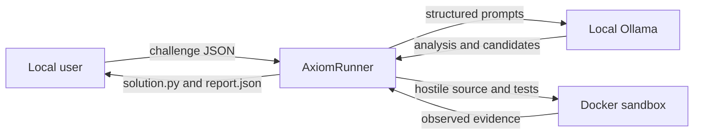
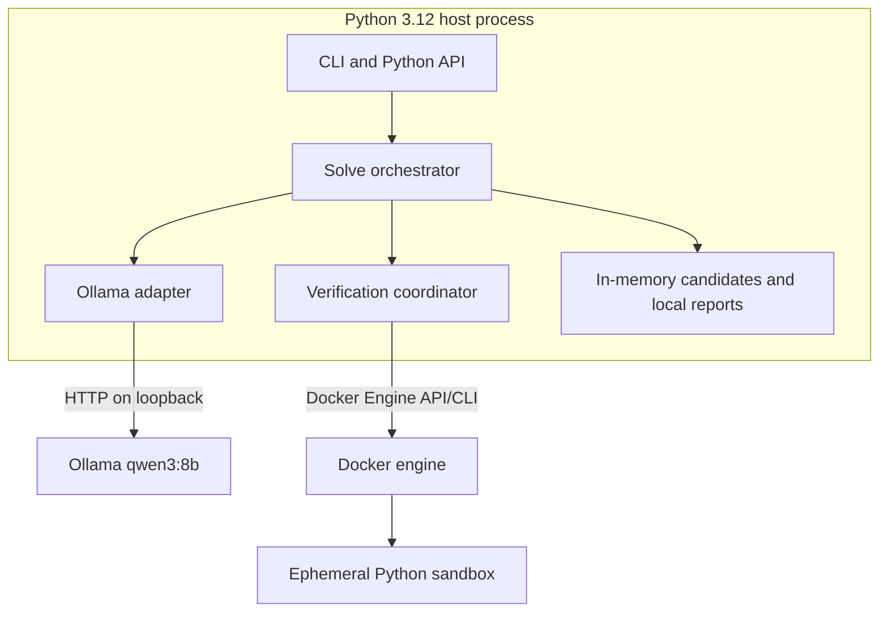
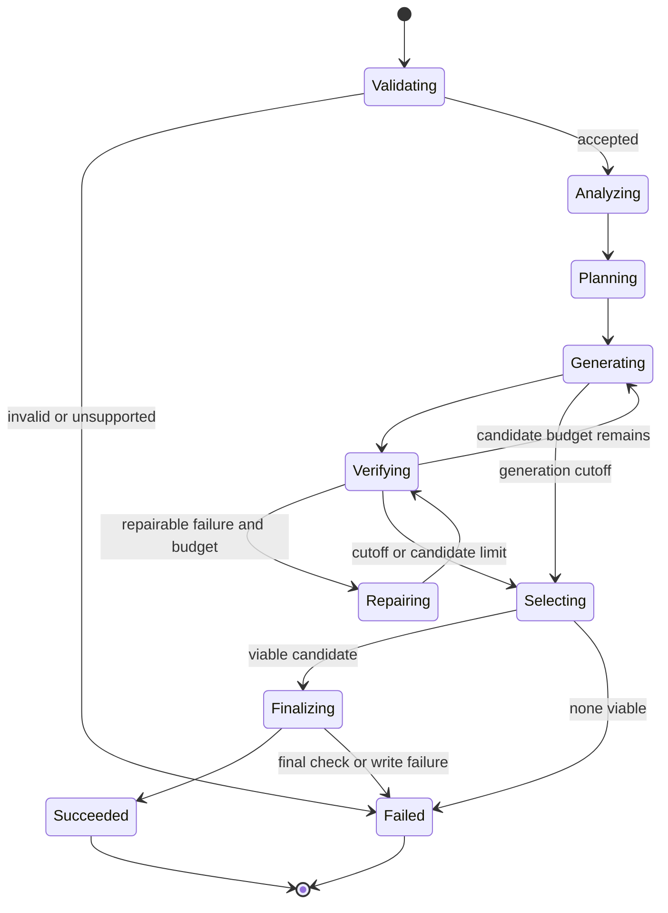

# System Architecture

## System context

Only the local user can initiate a run. Ollama is restricted to a loopback
address. Candidate execution crosses into a disposable, networkless container.
No hosted model, remote execution service, or challenge submission endpoint is
part of the system.

## Containers and deployment

The application is installed as a Python package. Docker is an external local
runtime dependency for dynamic verification. Generated source is mounted
read-only; generated harness and result directories are temporary. Run
artifacts are excluded from version control.

## Component view

| Component | Responsibility | Must not do |
| --- | --- | --- |
| Input loader | Parse bytes and construct a validated challenge | Repair malformed input or invoke a model |
| Budget manager | Own the monotonic clock and all phase cutoffs | Depend on wall-clock time |
| Ollama client | Enforce local endpoint, schemas, timeouts, and metrics | Execute returned content |
| Analyzer | Extract constraints, invariants, ambiguities, and test ideas | Produce source code |
| Strategy planner | Produce distinct complexity-valid approaches | Treat prose confidence as evidence |
| Candidate generator | Produce exact Python source | Write final output directly |
| Candidate repository | Preserve lineage and accumulated evidence | Discard earlier successful checks on repair |
| Static verifier | Parse, compile, inspect imports and entrypoint | Import candidate code on the host |
| Test designer | Produce examples, boundaries, properties, and oracle plans | See candidate implementation text |
| Sandbox | Run candidate and harness within limits | Enable network or writable host mounts |
| Evidence scorer | Rank observed outcomes deterministically | Score self-reported claims |
| Repair coordinator | Convert failures into bounded repair requests | Start repairs after the repair cutoff |
| Finalizer | Recheck and atomically publish the best candidate | Start new model work |

## Bottom-up drill-down

### Level 1: immutable values

- `ChallengeProblem` contains normalized source input and accepts only
  `language="python"`.
- `SolveOptions` contains model/runtime policy and never contains credentials.
- `PhaseBudget` contains absolute monotonic timestamps, not durations that can
  drift when retried.
- `Candidate` has an immutable ID, source, strategy ID, parent ID, revision,
  and generation metrics.
- `CheckResult` records check type, origin, status, duration, and structured
  details.
- `Evidence` is the append-only set of check results for one candidate.
- `SolveResult` contains terminal status, selected source/evidence, elapsed
  time, and whether any deadline cutoff fired.

### Level 2: invariants

- A candidate's parent is older and belongs to the same solve run.
- Only parsed Python with the exact requested top-level function can become
  viable.
- Every dynamically executed byte originated in an identified candidate or
  harness and runs only in the sandbox.
- Test generation does not receive candidate source, preventing direct
  implementation mimicry.
- Evidence can be added but not rewritten; repairs inherit prior provenance.
- A failing mandatory check makes a candidate non-viable.
- Finalization selects only among candidates known before the selection cutoff.
- The final output is either the complete selected source or absent; partial
  files are impossible.

### Level 3: services

- Domain constructors validate and normalize external data.
- Prompt roles translate domain values into schema-constrained model requests.
- Verifiers translate candidates and tests into observed evidence.
- The repository joins candidates, lineage, and evidence.
- Ranking is a pure function of evidence, complexity fit, and deterministic
  tie-breakers.
- The orchestrator is the only component allowed to advance solve state.

### Level 4: orchestration state machine

## Evidence scoring

Mandatory structural checks are pass/fail gates. Viable candidates are ordered
by public-example pass rate, independent-oracle pass rate, property and
metamorphic pass rate, boundary pass rate, complexity fit, and then lower
runtime. Candidate ID is the final stable tie-breaker. Model confidence and
unexecuted claims contribute zero points.

## Public interfaces

The library exposes `solve(ChallengeProblem, SolveOptions | None) ->
SolveResult`. The CLI exposes `solve`, `doctor`, and `benchmark`. CLI output is
human-readable status; source and evidence use explicit file paths. Exit codes
are `0` success, `2` invalid or unsupported input, `3` unavailable local
runtime/model, and `4` no viable candidate.
