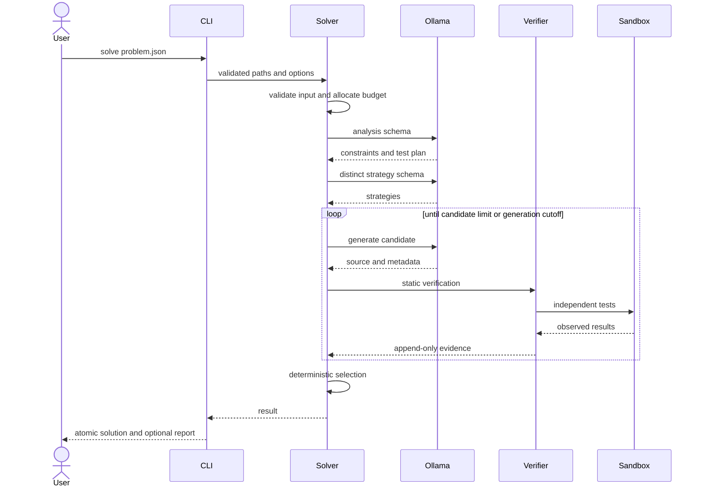

# Runtime Workflows

## Normal solve

## Deadline allocation

Let `T` be the declared deadline and `start` the monotonic start timestamp.
Finalization reserve `R` is `min(20, max(10, 0.05*T))`. The usable interval is
`U = T - R`. Input is rejected if `U <= 0`.

- Analysis target: first 25% of `U`.
- Strategy and initial generation target: next 35% of `U`.
- Verification and repair: remaining 40% of `U`.
- At `start + 0.80*U`, no new candidate may begin.
- At `start + 0.90*U`, no repair may begin and selection starts.
- At `start + U`, only final recheck and atomic publication may run.

Unused time flows forward. A phase cannot borrow from the finalization reserve.
Every external request receives a timeout no later than its phase deadline.

## Repair workflow

The verifier classifies a failure as structural, behavioral, resource,
infrastructure, or inconclusive. Only structural and behavioral failures are
repairable. A repair prompt receives the original statement, normalized
analysis, parent source, and minimized counterexamples. The new candidate keeps
the parent's evidence as provenance but must rerun every mandatory check.

## Failure workflows

- **Ollama unavailable:** `doctor` reports the endpoint/model issue. A solve
  terminates with runtime-unavailable status and does not create an output.
- **Malformed model response:** schema validation fails, one bounded retry uses
  the validation error, and repeated failure records model-protocol evidence.
- **Sandbox infrastructure failure:** retry once with a fresh container; a
  second infrastructure failure is inconclusive rather than a candidate fault.
- **Candidate timeout/resource breach:** terminate the container and record a
  mandatory candidate failure.
- **No viable candidate:** return exit code 4 with an evidence report when a
  report path was requested; do not create a solution file.
- **Final write failure:** preserve any existing destination file and remove
  the temporary file.

## Finalization

The selected source is parsed and compiled once more without host import. The
finalizer writes a sibling temporary file, flushes it, and replaces the target
atomically. Reports redact environment values and contain only normalized
configuration, model name, timings, candidate IDs, and verification evidence.
